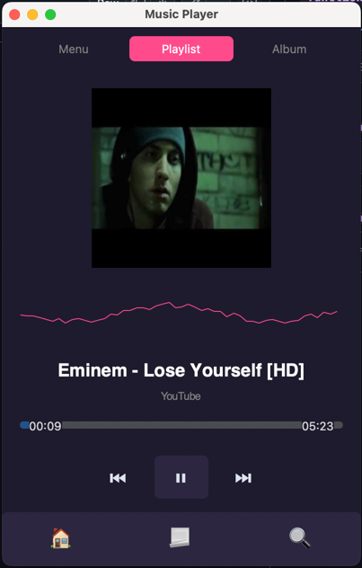
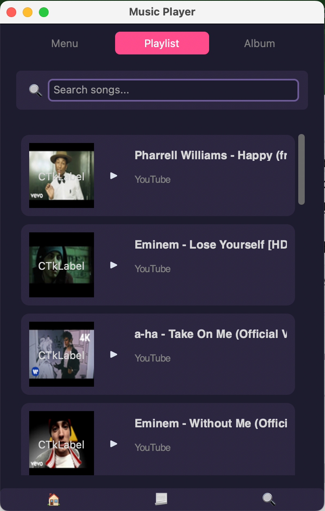
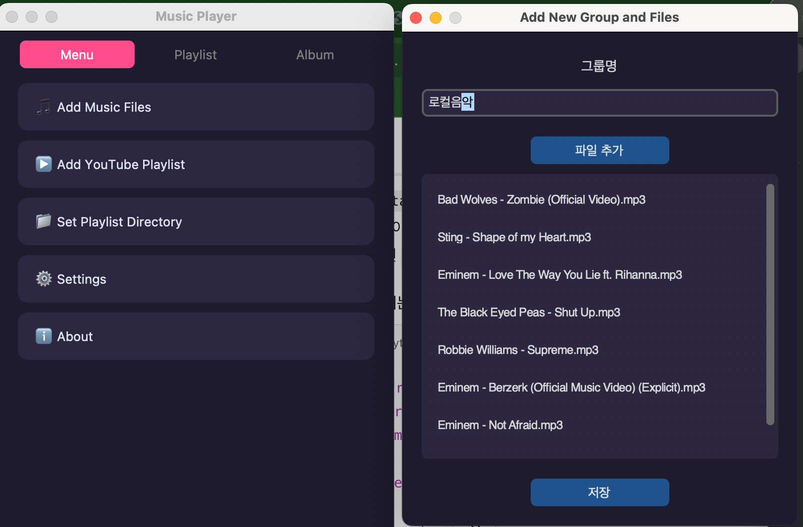
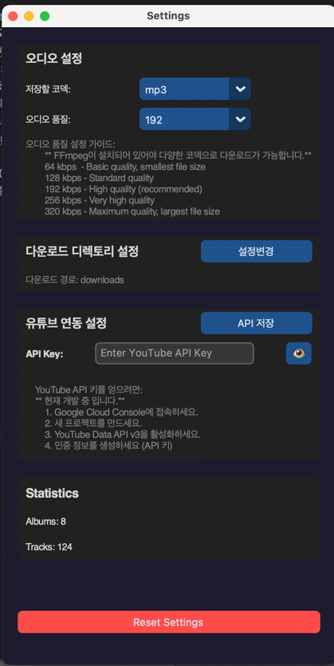

# PyTube Player - YouTube MP3 Downloader Player

**PyTube Player**는 YouTube 플레이리스트를 다운로드하고 MP3 형식으로 재생할 수 있는 간단한 음악 플레이어입니다. 이 프로그램은 Tkinter와 Pygame을 기반으로 한 GUI를 통해 사용하기 쉽고 직관적인 경험을 제공합니다. 또한 로컬 오디오 파일도 추가하여 재생할 수 있습니다.


---

## 주요 기능 및 설명.
- **YouTube 플레이리스트 다운로드 및 재생**: YouTube URL을 입력하여 플레이리스트를 다운로드하고 MP3 파일로 변환하여 재생할 수 있습니다.
- **로컬 파일 추가**: 로컬에 저장된 오디오 파일을 추가하여 재생할 수 있습니다.
- **재생 목록 관리**: 플레이리스트를 생성하고 파일을 관리할 수 있습니다.
- **앨범 아트 및 오디오 웨이브폼 시각화**: 현재 재생 중인 곡의 썸네일을 표시하며, 오디오 웨이브폼을 시각화합니다.
- **프로그레스 바 및 볼륨 조절**: 재생 중인 트랙의 진행 상황과 볼륨을 조절할 수 있습니다.
- 앨범 아트 및 오디오 웨이브폼 시각화: 현재 재생 중인 곡의 썸네일을 표시하며, 오디오 웨이브폼을 시각화합니다. 
- 프로그레스 바 및 볼륨 조절: 재생 중인 트랙의 진행 상황과 볼륨을 조절할 수 있습니다. 
- ffmpeg 자동 설치: 프로그램 실행 중 ffmpeg가 설치되어 있지 않으면, 자동으로 설치하고 설정 테이블에 기록하여 이후 중복 설치를 방지합니다. 
  - 윈도우는 utils에 ffmpeg이 포함되어 있습니다.
  - macos는 brew으로 자동 설치됩니다. (기다리시면 완료됩니다)
- mp3, wav, oog는 음악을 재생하고 관리할 수 있습니다. 그외에 m4a, flac, acc 등은 다운로드후 변환만 가능합니다.
- 유튜브 및 스포티파이 재생목록 관리를 위한 계정연동 (향후 지원 예정)




메인플레이 화면


플레이리스트 관리화면


로컬 파일 추가 화면


앨범관리 기능.


세팅 관리
---

## 설치 및 실행 방법

### 필수 라이브러리

프로젝트를 로컬에서 실행하기 위해서는 다음과 같은 Python 라이브러리가 필요합니다.

```bash
pip install -r requirements.txt
```

### 프로젝트 실행

프로젝트는 `main.py` 파일을 통해 실행할 수 있습니다.

```bash
python main.py
```

## EXE 파일로 실행하기 (Windows 사용자)

향후 `pyinstaller`를 이용해 `.exe` 파일로 변환하여 제공할 예정입니다. `.exe` 파일을 다운로드하면 Python 환경 없이도 쉽게 프로그램을 실행할 수 있습니다.

### EXE 파일 다운로드 및 실행

1. GitHub 릴리스 페이지에서 최신 버전의 `.exe` 파일을 다운로드합니다.
2. 다운로드한 `.exe` 파일을 더블 클릭하여 프로그램을 실행합니다.
3. 프로그램이 자동으로 실행되며, GUI를 통해 음악 파일을 추가하고 재생할 수 있습니다.

### 직접 EXE 파일 생성하기 (개발자용)

Windows에서 직접 `.exe` 파일을 생성하려면, 아래 명령어를 실행하세요. 이 명령어는 PyInstaller를 사용하여 Python 스크립트를 단일 `.exe` 파일로 변환합니다.

```bash
pyinstaller -w -F main.py
```

- `-w`: 콘솔 창을 숨깁니다.
- `-F`: 단일 실행 파일로 생성합니다.

생성된 `.exe` 파일은 `dist/` 폴더 내에 저장됩니다. 이 파일을 다른 Windows 사용자와 공유할 수 있습니다.

## 파일 구조
```plaintext
PyTube Player/
├── main.py                    # 메인 프로그램 파일
├── database_manager.py         # 데이터베이스 관리 기능
├── ytbList_player.py           # YouTube 플레이리스트 관리 기능
├── file_addmodal.py            # 로컬 파일 추가 모달 창
├── settings_view.py            # 세팅 관리 창.
├── audio_waveform_visualizer.py # 오디오 웨이브폼 시각화 모듈
├── assets/
│   └── images/                 # 썸네일 및 기본 이미지 파일
└── README.md                   # 프로젝트 설명 파일
```
## 향후 업데이트

- GUI 개선 및 사용자 경험 향상
- 유튜브 및 스포티파이 재생목록 관리를 위한 계정연동 
- 리팩토링: 모듈화


## 기여
이 프로젝트에 기여하고 싶다면 언제든지 Pull Request를 제출해 주세요! 코드 개선, 버그 수정, 기능 추가를 환영합니다.

"💖 이 앱이 당신의 일상에 작은 행복을 더해줬다면, 저희의 노력에 따뜻한 커피 한 잔으로 응원해주세요. 🌱

#한잔의행복"

<a href="https://www.buymeacoffee.com/cookymanm" target="_blank"></a>

## 라이선스

MIT License를 따릅니다.
